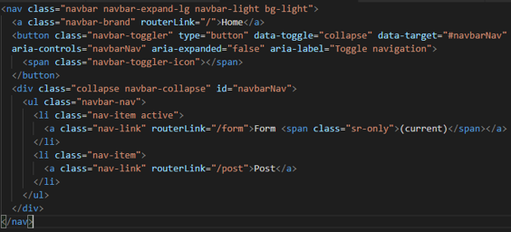
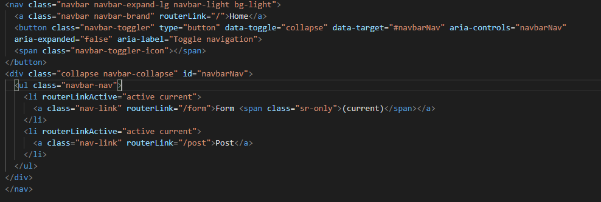
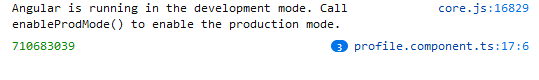

### Routing dan Navigasi

- Buat project baru yang berisi komponen posts (praktikum http service), form-member (soal uts), navbar, not-found, home

- Buka file app.module.ts. Pastikan komponen pada langkah 1 sudah terdaftar seperti gambar dibawah ini

- Tambahkan module router pada halaman app.module.ts seperti gambar dibawah ini:

- Buka halaman navbar.component.html dan tambahkan kode dibawah ini:

- Buka halaman app.component.html. tambahkan kode dibawah ini:

- Jalankan dan catat hasilnya 

- Buka halaman app.component.html dan rubah menjadi seperti dibawah ini:

- Jalankan dan inspect elemen seperti pada gambar dibawah ini

- Jalankan link dibawah ini localhost:4200/form 

- Jalankan link dibawah ini localhost:4200/post 

- Jalankan link dibawah ini localhost:4200/coba 

- SImpulkan langkah 3, 4 dan 5 
- output yang dikeluarkan akan berbeda sesuai dengan link yang kita ketik. hasil dari link form adalah form-member works, hasil link post adalah post works sedangkan yang link coba adalah not-found works

- Buka halaman navbar.component.html. tambahkan link pada href tiap menu seperti gambar dibawah ini:

- Jalankan, catat dan berikan penjelasan 

- Modifikasi href menjadi routerLink pada halaman navbar.component.html seperti gambar dibawah ini:

- Jalankan, inspect element, coba link dan cek pada tab network. Catat dan beri penjelasan 

- Modifikasi class li pada halaman navbar.component.html menjadi seperti pada gambar dibawah ini:

- Buat komponen baru dengan nama profile dengan perintah ng g c profile

- Buka app.module.ts dan tambahkan route untuk profile seperti gambar dibawah ini:

- Modifikasi halaman home.component.html menjadi seperti gambar dibawah ini

- Jalankan, klik tombol home kemudian kliklink joko bowo kemudia inspect element seperti dibawah ini:

- Modifikasi file profile.component.ts menjadi seperti pada gambar dibawah ini:

- Jalankan, klik tombol home kemudian klik link joko bowo kemudia inspect element. Catat dan berikan penjelasan 

