# Bab 5 Directive 

### ngIf

- Directive ngIf digunakan untuk sebuah kondisi percabangan

- buka file app.component.ts

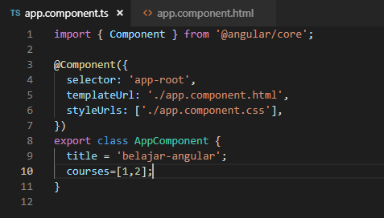

- buka file app.component.html

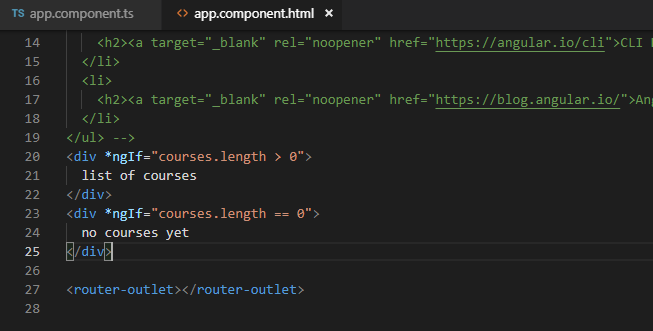

- Jalankan localhost hasil seperti berikut

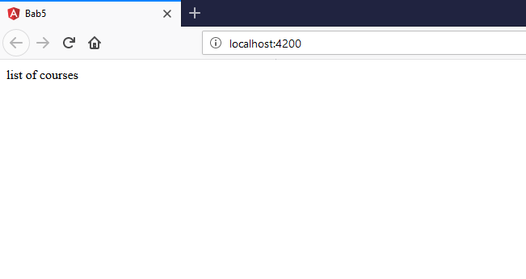

#### contoh kedua menggunakan else:

- buka file app.component.html modifikasi kodenya

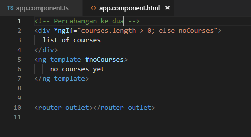

- Jalankan localhost dengan konndisi array pada app.component

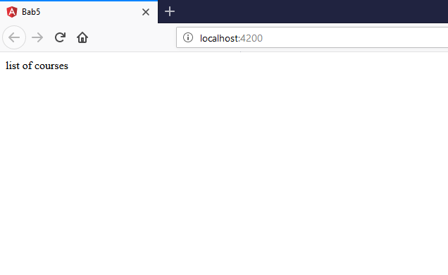

- dengan array kosong

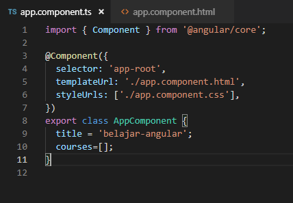

- hasilnya :

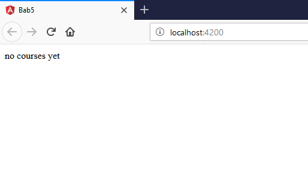

- dengan array ada isi

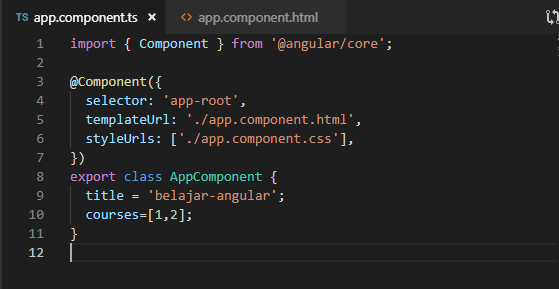

- hasilnya :

#### cara ketiga :

- buka file app.component.html modifikasi kodenya

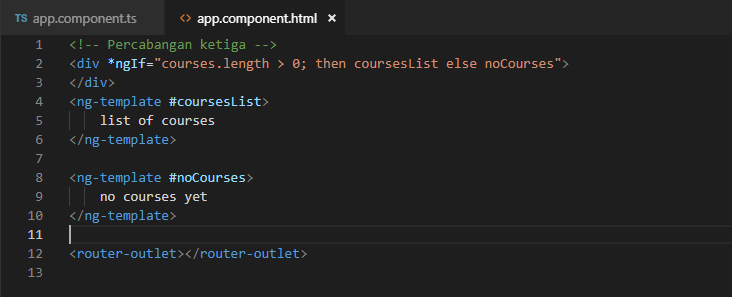

- jalankan localhost dengan kondisi array pada app.component
- dengan array kosng

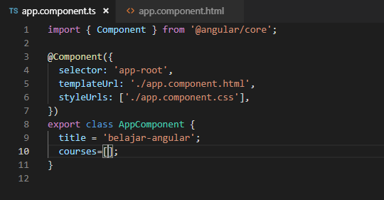

- hasilnya :

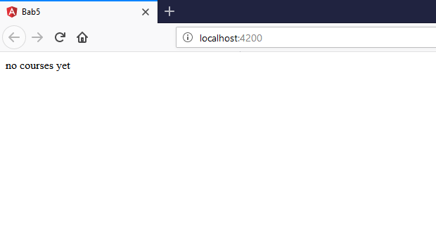

- dengan array ada isi

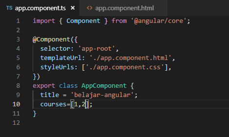

- hasilnya :

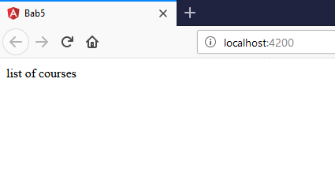

### Hidden Property

- buka app.component.html

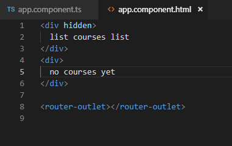

- jalankan localhost hasilnya :

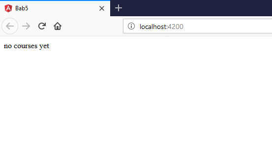

- selain contoh diatas kita juga dapat memberikan property

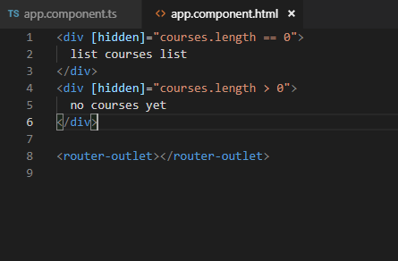

##### dengan catattan pada app.component.ts pada courses terdapat array courses dengan nilai 1 dan 2

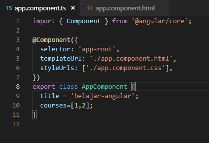

- hasilnya :

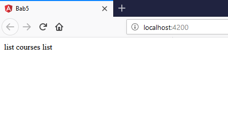

- kita inspect element akan terlihat property hidden tidak terdapat kondisi true ataupun false

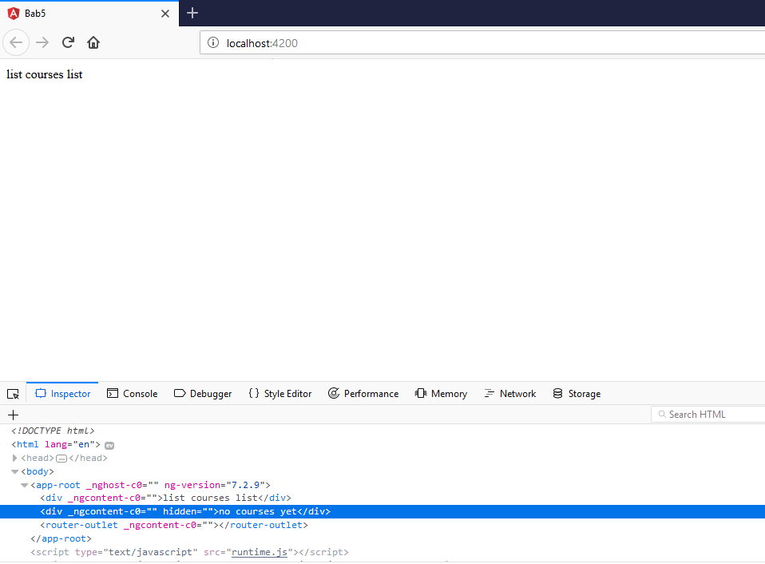

- berbeda jika menggunakan ngIF terdapat bindings dengan nilai false

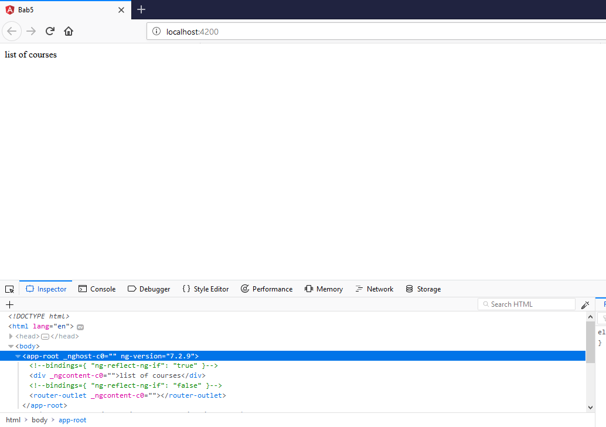

#### ngSwitchCase

- buka file app.component.html modifikasi codenya

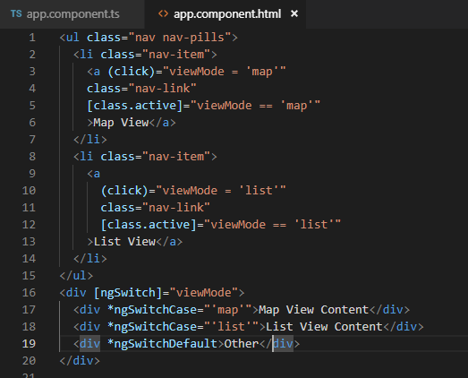 

- buka file app.component.ts tambahkan property viewMode

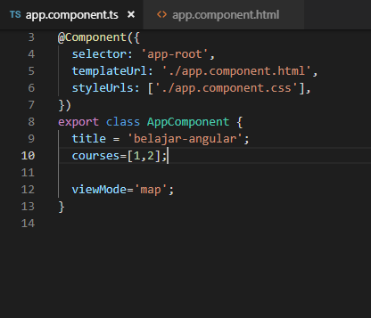

- hasilnya :

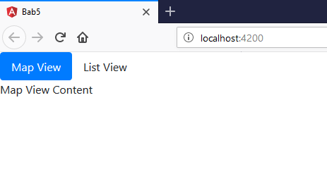

#### ngFor

- buka app.component.ts property CoursesFor yang berisikan array

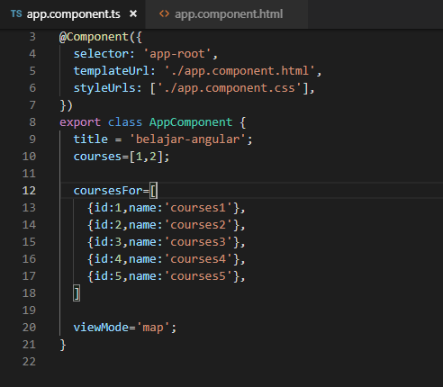

- buka file app.component.html tambahkan directive ngFor pada element li

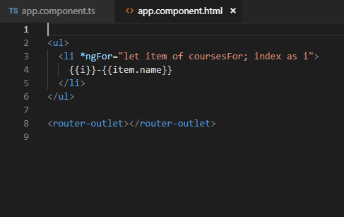

- hasilnya :

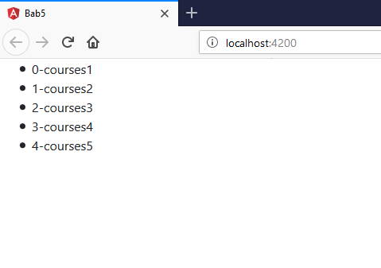

- kita juga dapat memberi tanda tertentu pada index yang bernilai ganjil dengan menggunakan isEven

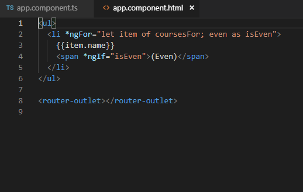

- hasilnya :

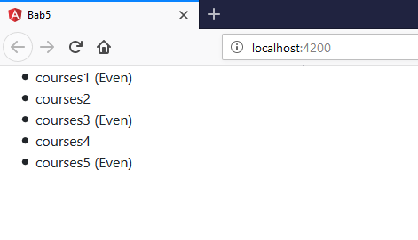

#### ngFor dang change Detection

- Pada percobaan ini kita akan menambahkan sebuah data array pada coursesFor 
- tambahkan button pada app.component.html 

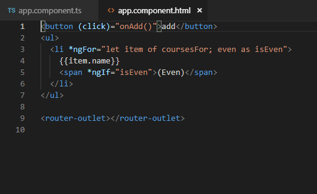

- tambahkan method onAdd() 

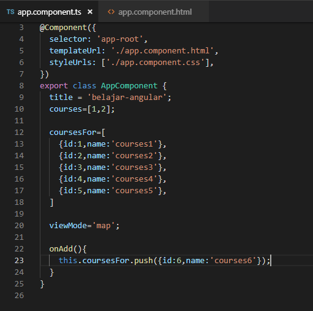

- sehingga hasilnya seperti berikut (jika kita tekan button add maka akan ditambahkan sebuah data courses 6)

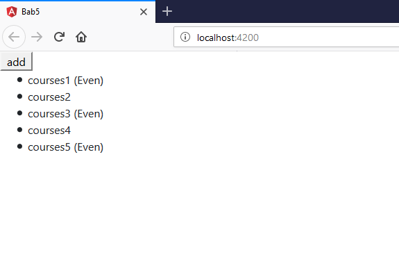

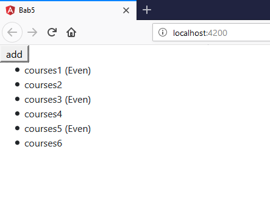

- setelah kita berhasil menambahkan sebuah data array pada courseFor maka untuk selanjutnya kita akan mencoba untuk melakukan penghapusan data. 
- Tambahkan sebuah method onRemove pada app.component.ts 

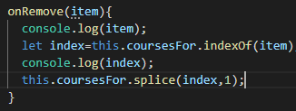

- inspect element pada saat klick button remove

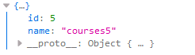

- Buka app.component.html dan tambahkan sebuah button untuk menghapus 

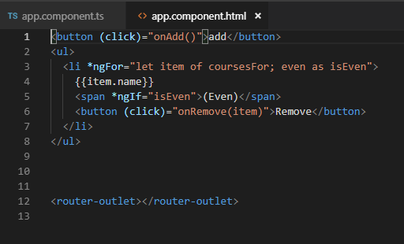

- hasilnya seperti berikut (pada saat button remove diclick maka salah satu data akan hilang sementara) 

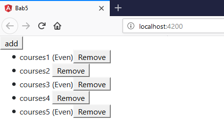

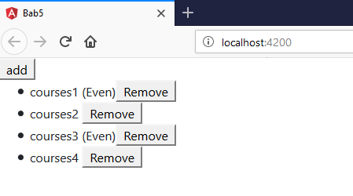

- selain itu kita juga dapat melakukan perubahan status menggunakan event click 
- buka file app.component.html tambahkan button

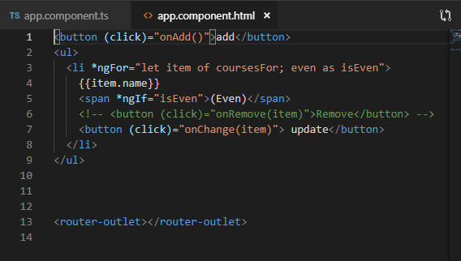

- buka file app.component.ts buatlah sebuah method onChange dengan parameter item dan didalam method tersebut adanya perubahan string menjadi updated 

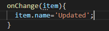

- hasilnya :

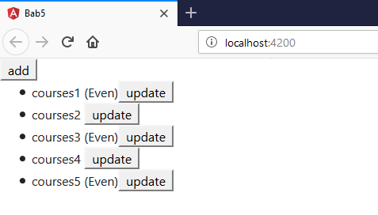

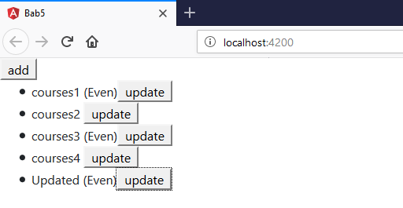

#### ngFor dan trackby 

- Buka file app.component.ts buatlah sebuah method dengan nama loadCourses, tapi sebelumnya buat sebuah property dengan nama coursesForOne

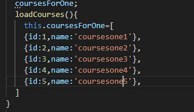

- buka file app.component.html dan tambahkan code 

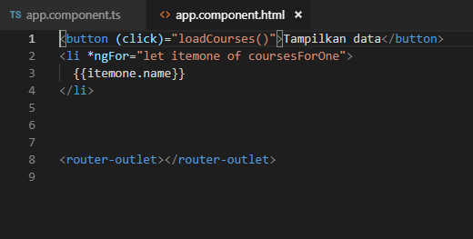

- hasilnya saat button diclick 

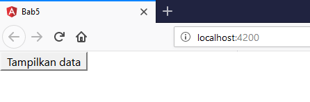

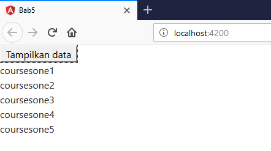

- sekarang kita lakukan analisa buka inspect element, saat button belum diclick 

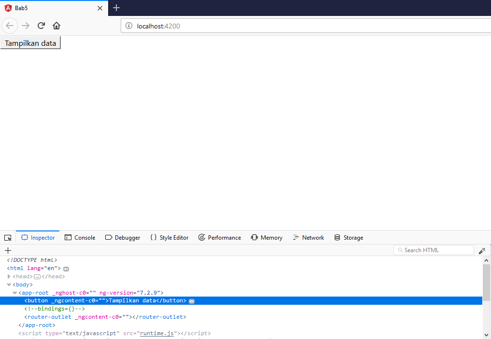

- dan saat button diklik maka element ul akan muncul

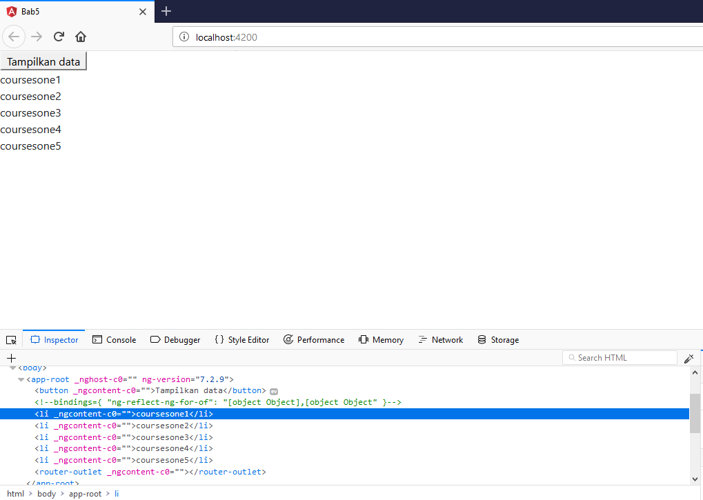

- jika kita lakukan klik kembali maka button akan merespon kembali dengan menampilkan data yang sudah ada dalam arti mengunduh ulang yang sudah ada

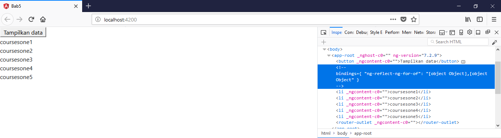

- oleh karena itu kita membutuhkan TrackBy yang nanti digunakan untuk mengecek jika data sudah ada maka button tidak perlu melakukan actionnya kembali 

- untuk menambahkan TrackBy dengan cara menambahkan pada app.component.html pada directive ngFor 

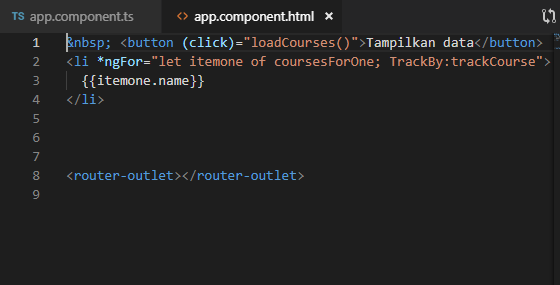

- selain itu tambahkan juga sebuah method trackCourse dengan parameter index dan itemone pada app.component.ts  

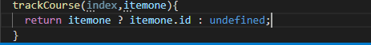

- jika berhasil maka pada saat button tampilkan data diklik untuk kedua kalinya pada inspect element tidak ada muncul highlight ungu pada masing-masing element li

### The leading Asterik 

-  kita memberi tahu angular untuk menulis ulang markup tertentu

- menggunakan ng template dengan menggunakan property binding 

- class binding fa-star dan fa-star-o 

- selain menggunakan class binding seperti diatas kita juga dapat menggunakan attribute directive

#### Custom Directive 

- pertama kita harus membuat directive dengan nama input-format terlebih 

- jika directive berhasil digenerate maka kita pastikan di app.module.ts pada @NgModule terdapat nama directive yang kita buat tadi 

- buka input-format.directive.ts dan tambahkan decorator HostListener

- Buka file app.component.html dan tambahakn code 

- terdapat appInputFormat adalah selector pada inputformat.directive.ts 
 
 

 - Kita jalan localhost:4200 setelah itu lakukan percobaan click pada textbox dan click diluar textbox

 

 

 - buka file input-format.directive.ts dan modifikasi codenya 

 

 - Jalankan localhost dan berikan masukan dengan huruf besar semua setelah itu tekan tab

 

 

 - buka file app.component.html dan tambahkan property binding dengan nama format

 

 - buka file input-format.directive.ts tambahkan decorator input dan modifikasi codenya

 

 - buka  app.component.html 

 

 -  atau kita juga dapat menggunakan cara lain yaitu menggunakan nama selector sebagai property binding 

 - buka app.component.hml modifikasi codenya 

 

 - buka input-format.directive.ts dan tambahkan decorator input dengan parameter appInputFormat 

 - Jika dijalankan sebagai contoh kita memasukkan kalimat dengan huruf kecil dan pada saat kita tab maka akan berubah menjadi huruf besar semua seperti berikut 

 

 
