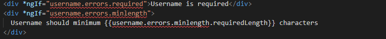

### Jobsheet-8: - Reactives Form 

#### Praktikum – Bagian 1: Building a Bootstrap Form

- Buat component baru dengan nama signup-form dengan perintah ng g c signup-form

- Modifikasi app.component.html menjadi seperti berikut:

- Modifikasi file signup-form.component.html menjadi seperti berikut:

- Jalankan dan Catat hasilnya

#### Praktikum – Bagian 2: Control Programmatically

- Modifikasi file signup-form.component.ts seperti dibawah ini:

- Modifikasi signup-form.component.html menjadi seperti berikut:

- Jalankan dan Catat hasil inspect elemen pada bagian console 

- Modifikasi file app.module.ts tambahkan kode berikut:

- Jalankan dan Catat hasilnya di bagian console pada browser 

#### Praktikum - Bagian 3: Adding Validation 

- Modifikasi signup-form.component.ts menjadi seperti berikut:

- Modifikasi signup-form.component.html menjadi seperti berikut:

- Jalankan, apakah validasi formnya berfungsi dan Catat hasilnya 

- Tambahkan get username pada file signup-form.component.ts seperti berikut:

- Modifikasi file signup-form.component.html menjadi seperti berikut:

- Jalankan dan Catat hasilnya 

#### Praktikum - Bagian 4: Specific Validation Errors

- Modifikasi signup-form.component.ts menjadi seperti berikut:

- Modifikasi signup-form.component.html menjadi seperti berikut:

- Jalankan dan Catat hasilnya

- Modifikasi signup-form.component.html menjadi seperti berikut:

- Jalankan dan Catat hasilnya 

#### Praktikum - Bagian 5: Custome Validation

- Buat file baru pada folder signup-form dengan nama username.validators.ts dan isi dengan script sebagai berikut:

- Modifikasi signup-form.component.ts menjadi seperti berikut:

- Modifikasi signup-form.component.html menjadi seperti berikut:

- Jalankan dan Catat hasilnya 

#### Praktikum - Bagian 6: Asyncronus Validation

- Modifikas file username.validators.ts seperti berikut:

- Modifikasi signup-form.component.ts menjadi seperti berikut:

- Modifikasi signup-form.component.html, tambahkan 
 seperti berikut:

- Jalankan dan Catat hasilnya 

#### Praktikum - Bagian 7: Displaying a Loader Image

- Modifikasi signup-form.component.html, tambahkan 
 seperti berikut:

- Jalankan dan Catat hasilnya 

#### Praktikum - Bagian 8: Validating Form on Submit

- Modifikasi signup-form.component.ts, dengan menambahkan method login() seperti berikut:

- Modifikasi signup-form.component.html seperti berikut:

- Jalankan dan Catat hasilnya 

