### Jobsheet-9: HTTP Service

#### Praktikum - Bagian 2 : Getting Data

- Buat component baru dengan nama posts dengan perintah ng g c posts

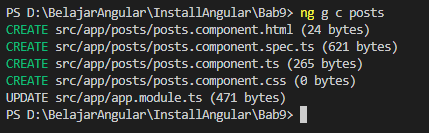

- Untuk menggunakan HTTPService, kita perlu melakukan import HttpModule pada app.module.ts.

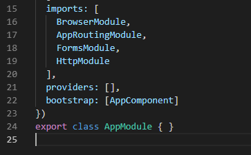

- Setelah kita menambahkan HttpModule pada bagian imports, maka secara otomatis akan menambah imports pada bagian paling atas

- Hint :
Jika HttpModule tidak muncul secara otomatis maka anda harus menginstal terlebih dahulu dengan perintah npm i @angular/http

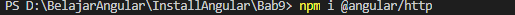

- Modifikasi file posts.component.ts menjadi seperti berikut:

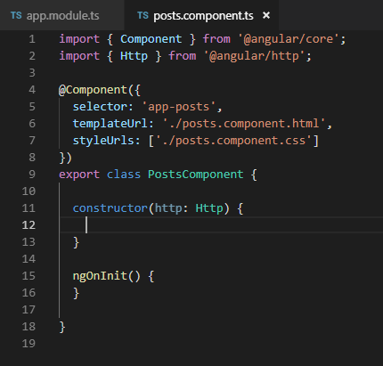

Class Http pada contructor digunakan untuk melakukan HTTP request ke back end.

- Ubah file app.component.html seperti berikut :

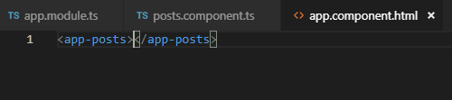

- Jalankan dan Catat hasilnya

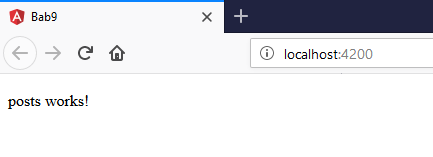

- Bagaimana jika anda lupa melakukan import HttpModule pada langkah ke-2 ? Lakukan commenting pada HttpModule seperti pada kode berikut :

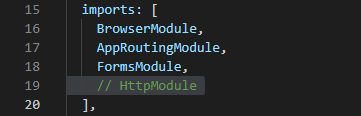

- Apa yang terjadi pada console? 

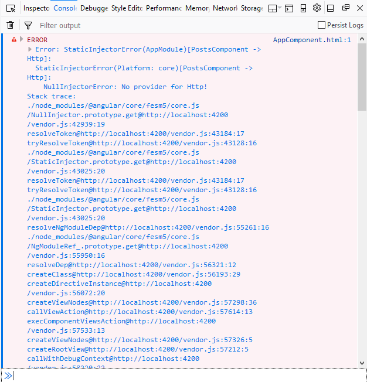

- Lengkapi kode program pada posts.component.ts menjadi :

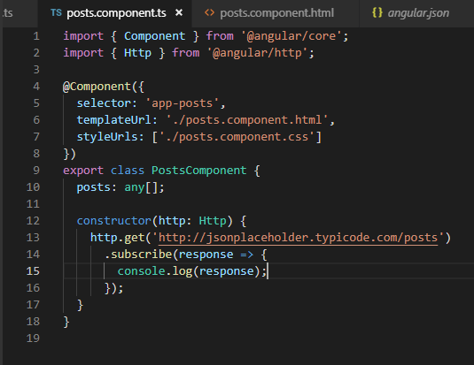

- Jalankan pada browser 

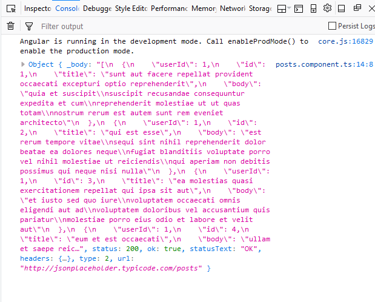

- perbedaan yang terjadi pada console jika kode pada posts.component.ts diubah menjadi :

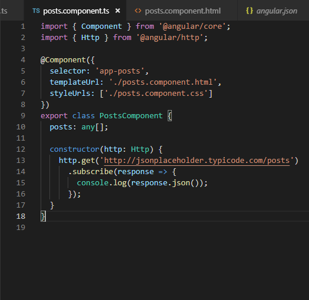

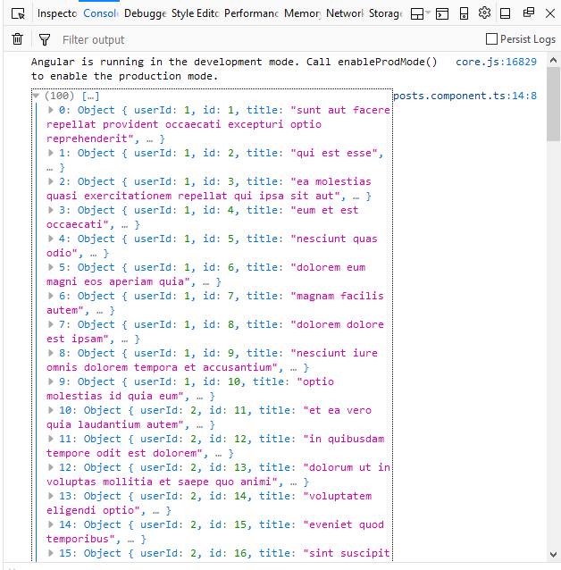

- Untuk menampilkan data pada halaman browser, ubah kode program pada posts.component.html seperti berikut :

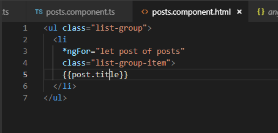

- Ubah kode program pada posts.component.ts :

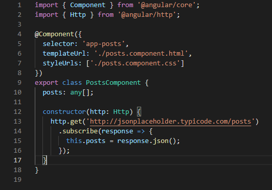

- Jalankan

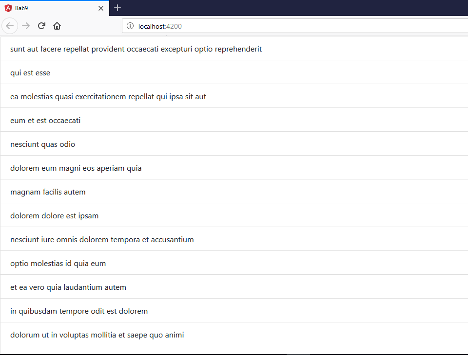

#### Praktikum - Bagian 3 : Creating Data

- Pertama, tambahkan input elemen pada posts.component.html :

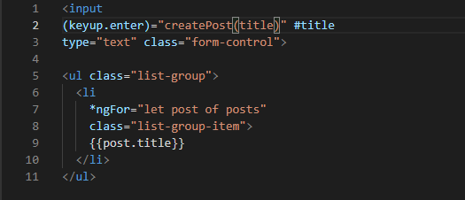

- Modifikasi kode program pada posts.component.ts 

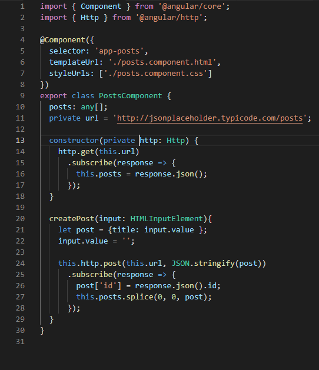

- Simpan dan jalankan pada browser.

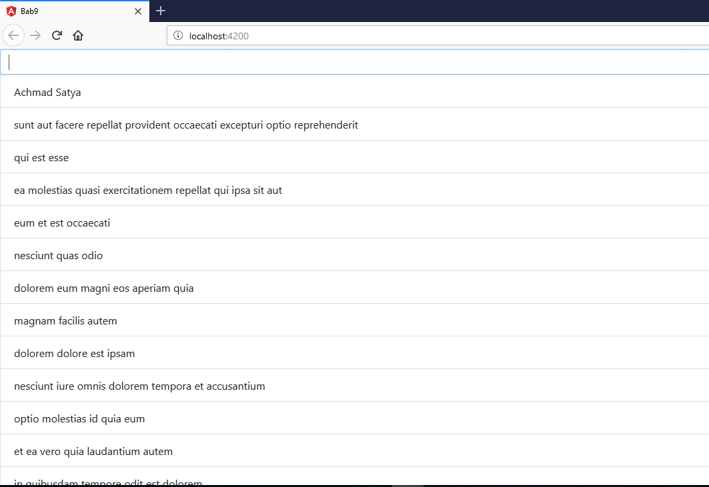

#### Praktikum - Bagian 4 : Updating Data

- Tambahkan button Update dengan modifikasi kode program seperti di bawah ini :

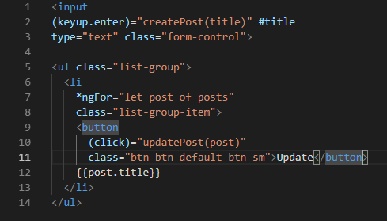

- Tambahkan fungsi updatePost pada posts.ts seperti di bawah :

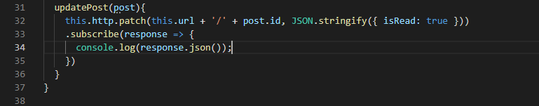

- Simpan dan jalankan pada browser.

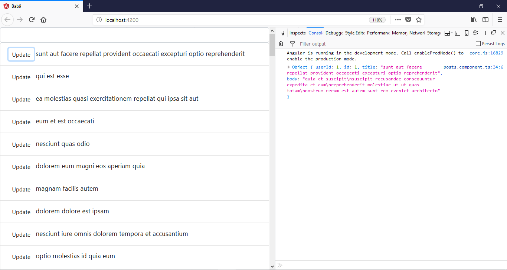

#### Praktikum - Bagian 5 : Deleting Data

- Tambahkan button Delete dengan modifikasi kode program seperti di bawah ini :

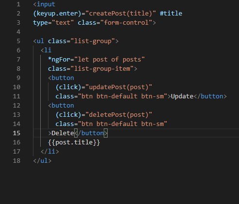

- Tambahkan fungsi deletePost pada posts.ts seperti di bawah :

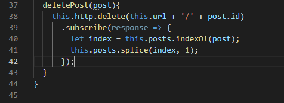

- Simpan dan jalankan pada browser.

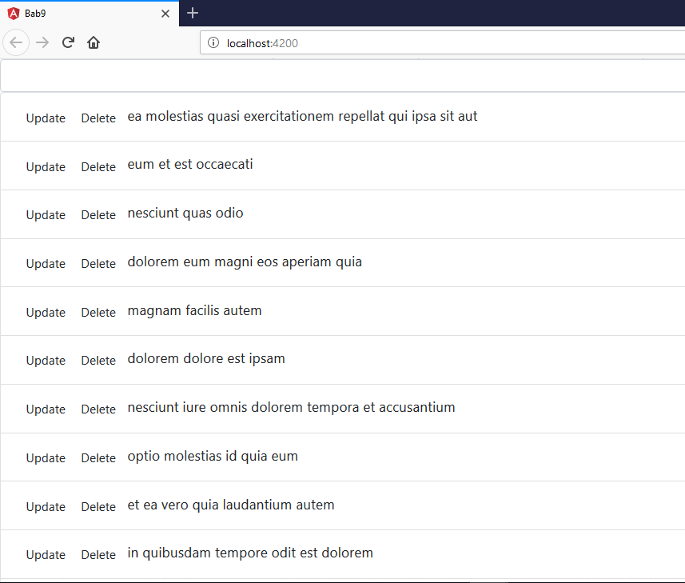